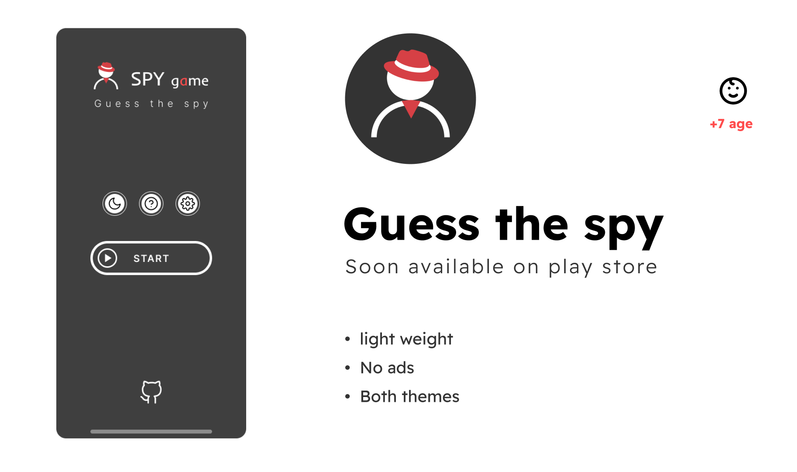

# Spy game on android 🕵️‍♂️

Spy game app, designed for android. Intuitively simple and fun to play. 

## System requirements ⚙️
- Android version 5 or higher
- At least 512mb of RAM

## Goal of the game 🎯
There are 2 types of players - spies and regular players. Non-spy players will be given the location, and the goal of the spies is to guess the location before the game ends. The players' objective is to determine who the spies are.

## Rules ✎
Before starting the game, players need to choose a location for the game, specify the number of players and spies, and also the time.

As the game starts, all players will ask questions each other one by one (only yes or no questions are allowed). It starts with one player choosing another one to answer his question related to the secret location. Then the one who was asked will be the next to choose and ask a question. This cycle repeats until the end of a game. At the end all players should start discussing whom to eliminate.

The player with most votes gets eliminated (if a player was a spy, players win. Otherwise spies' win).

## Credits ©️
- App developed by Danial
- Designed by Alerrad